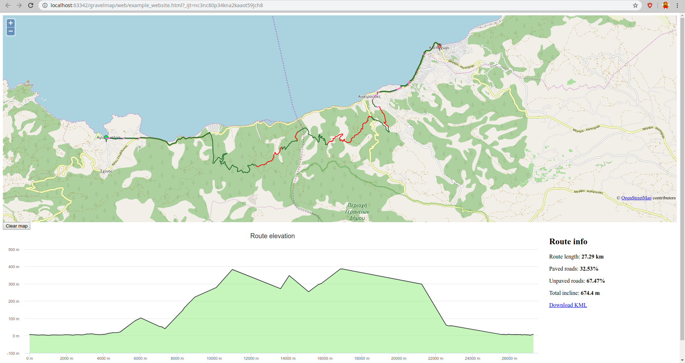

**WIP**

# Gravel map

Gravelmap is a routing engine made for off-road adventurers (hikers, mountain bikers, SUVs).

## Installation guide

**Prerequisites:** You need to have *osmium* installed in your system (https://osmcode.org/osmium-tool/). Also you need to have it set in $PATH.

Example of building and running in Ubuntu x64:

```bash
git clone git@github.com:thanosKontos/gravelmap.git
cd gravelmap
cp .env.dist .env
env GOOS=linux GOARCH=amd64 go build -o /tmp/gravelmap cmd/main.go && /tmp/gravelmap version
```

## Import OSM data

The 2 commands below will extract the needed osm data for routing and create all the routing files.

At the moment the graph.

```bash
go run cmd/main.go filter-osm --input ~/Downloads/bremen-latest.osm.pbf --output ~/Downloads/bremen_for_routing.osm.pbf
go run cmd/main.go import-routing-data -v info --input ~/Downloads/bremen_for_routing.osm.pbf
```

## Create web-server

This is not part of the actual toolkit. It is just an example of how you may use the data from the above commands.

Plus is a nice way for me to debug the result in a nice interface.

```bash
env GOOS=linux GOARCH=amd64 go build -o /tmp/gravelmap cmd/main.go && /tmp/gravelmap create-web-server
```

Open example_website_from_to.html to test routing



## Special thanks

To Ryan Carrier for the dijkstra implementation (taken from here: https://github.com/RyanCarrier/dijkstra).
